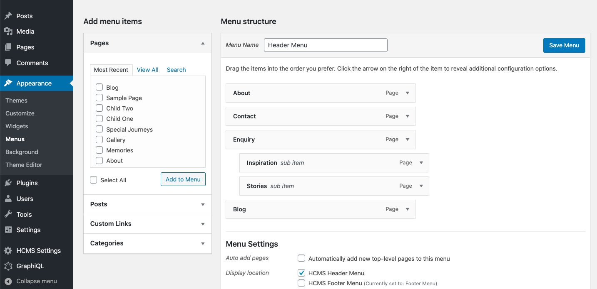
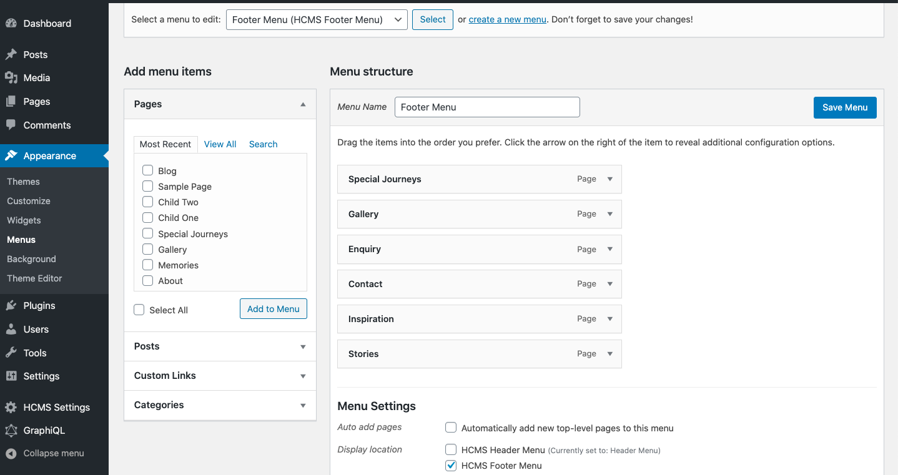
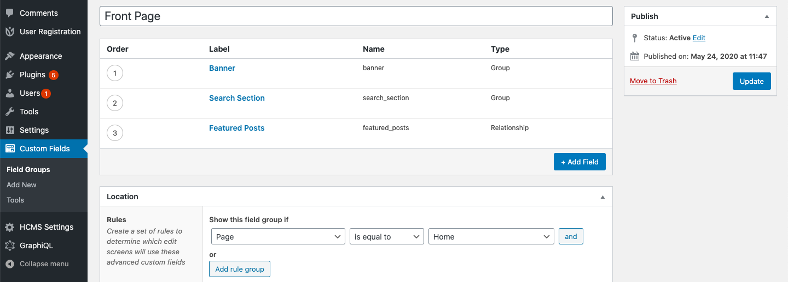

## gatsby-wp-elementor-blog

A Gatsby site using WordPress as a headless CMS.
Front end wiring in Gatsby/React with backend content in WordPress.

### Originally Created from Gatsby-WordPress-Theme-Phoenix with additional updates to allow for using WP Elementor

## Features

1. Uses React with Gatsby ( Should Be Fast )
2. PWA ( Works Offline )
3. Image Optimization ( w/ blur effect )
4. ACF - Advanced Custom Fields ( from WP )
5. GraphQL ( in Gatsby and with wp-graphql on WordPress )
6. Blog Page with Pagination
7. Offline Search Feature
8. Categories, Archive Page, Custom Home Page
9. Custom Widgets, Menus

## Set Up

### Gatsby Setup

- Rename [`env-example`] (e.g. .../site/env-example) to [`.env`], set the GATSBY_WORDPRESS_SITE_URL to your WordPress site and the FRONTEND_URL to your localhost for dev/test and then your front-end gatsby url when in production:

```shell script
GATSBY_WORDPRESS_SITE_URL=xxx
FRONTEND_URL=xxx # Set this to http://localhost:3000 for dev/test and your live front-end gatsby url for production.
GATSBY_ELEMENTOR_SUPPORT=true
GATSBY_SIDEBAR=false
```

- Make sure there aren't any trailing /'s in the URL

### WordPress Setup

1. Upload and activate all the plugins from wordpress/plugins folder of this repo into your WordPress Site.

THEN,

2. - Set Header menu as `HCMS Header Menu`

   

   - Set Footer menu as `HCMS Footer Menu`
     

3. You can also set text widgets in #HCMS Footer #1 and #HCMS Footer #2 under Appearance > Widgets in WordPress.
4. Import all the ACF data from `wordpress/acf-data` json file of this repo, into WordPress by going to WordPress Dashboard > Custom Fields > Tools > Import
5. Create a Home Page ( if there isn't one already )and make sure you have a home page and Location rule is set to Home page.
   
6. Add the ACF required data on the Home page from WordPress Dashboard from acf.
7. If not already done, set your site title, description and logo from WordPress customizer.
8. Make sure on the Home page that under Settings that the Permalink..URL Slug is set to home

**Open the source code and start editing however you'd like for add'l changes**
**To see your site in action type the following**

`npm run dev`

Your site is now running at `http://localhost:8000`!

_Note: You'll also see a second link: _`http://localhost:8000/___graphql`_. This is a tool you can use to experiment with querying your data. Learn more about using this tool in the [Gatsby tutorial](https://www.gatsbyjs.org/tutorial/part-five/#introducing-graphiql)._

## Development

- Navigate into site’s directory.

```shell
yarn install      # Run this for the first time.
npm run dev      # During development.
npm run build    # When ready for production.
```

### Originated from the following theme on npm

[gatsby-wordpress-theme-phoenix](https://www.npmjs.com/package/gatsby-wordpress-theme-phoenix)
